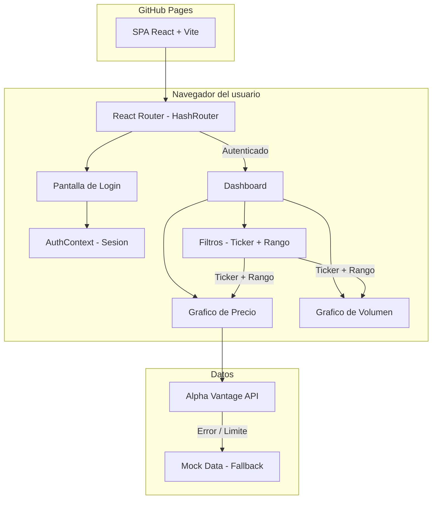
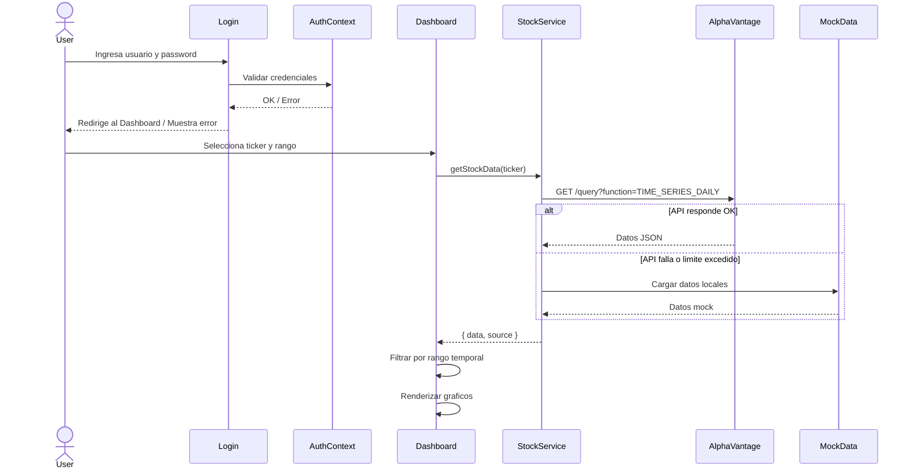
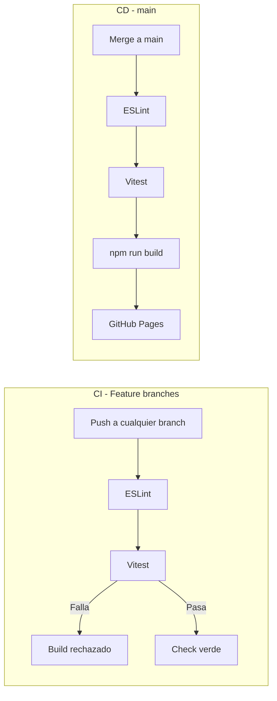

# Arquitectura - Financial Dashboard

## Descripcion general

Financial Dashboard es una Single Page Application (SPA) construida con React y Vite, desplegada en GitHub Pages. Permite visualizar datos financieros de acciones (stocks) con graficos interactivos y filtros.

La aplicacion es completamente estatica (sin backend). Los datos se obtienen desde la API de Alpha Vantage en el navegador del usuario, con datos mock como fallback.

## Diagrama de arquitectura



## Flujo de datos



## Estructura del proyecto

```
src/
  components/          Componentes reutilizables
    Navbar.jsx         Barra de navegacion con logout
    PriceChart.jsx     Grafico de linea (precio de cierre)
    VolumeChart.jsx    Grafico de barras (volumen)
    TickerSelector.jsx Selector de ticker (AAPL, GOOGL, etc)
    RangeSelector.jsx  Botones de rango temporal (1S, 1M, 3M, 6M, 1A)
    ProtectedRoute.jsx Proteccion de rutas privadas
  pages/               Paginas de la aplicacion
    Login.jsx          Pantalla de login
    Dashboard.jsx      Dashboard principal con graficos y filtros
  context/             Estado global
    AuthContext.jsx     Proveedor de autenticacion
    auth-context.js    Definicion del contexto
    useAuth.js         Hook para acceder al contexto de auth
  services/            Logica de datos
    stockService.js    Servicio que consulta Alpha Vantage o mock
    mockData.js        Datos mock para 5 tickers
  test/                Configuracion de tests
    setup.js           Setup de jest-dom
```

## Decisiones de diseno

| Decision | Alternativa | Por que |
|----------|-------------|---------|
| React + Vite | Next.js, CRA | No necesitamos SSR. Vite es mas rapido para desarrollo y build |
| HashRouter | BrowserRouter | GitHub Pages no soporta rutas SPA con BrowserRouter |
| Recharts | Chart.js, D3 | API declarativa que encaja con React, facil de usar |
| Alpha Vantage | Yahoo Finance, Finnhub | API gratuita con datos diarios, no requiere registrar app |
| Mock data como fallback | Solo API | El tier gratuito tiene limite de 25 req/dia, mock garantiza que la demo siempre funcione |
| sessionStorage | localStorage | La sesion se limpia al cerrar el navegador, mas seguro para credenciales hardcodeadas |
| Context API | Redux, Zustand | Para un solo estado global (auth) no se justifica una libreria externa |

## Pipelines CI/CD



Los pipelines estan documentados en detalle en [CI_CD_GUIDE.md](CI_CD_GUIDE.md).

## Tecnologias

| Tecnologia | Version | Uso |
|------------|---------|-----|
| React | 19 | Framework UI |
| Vite | 8 | Build tool y dev server |
| React Router | 7 | Routing SPA |
| Recharts | 3 | Graficos |
| Vitest | 4 | Testing |
| React Testing Library | 16 | Testing de componentes |
| ESLint | 10 | Linting |
| GitHub Actions | - | CI/CD |
| GitHub Pages | - | Hosting |
