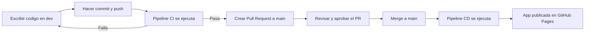
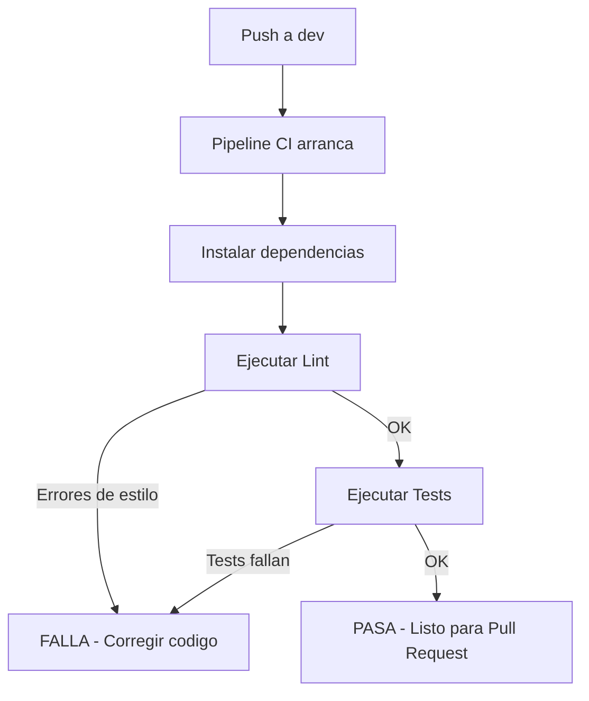
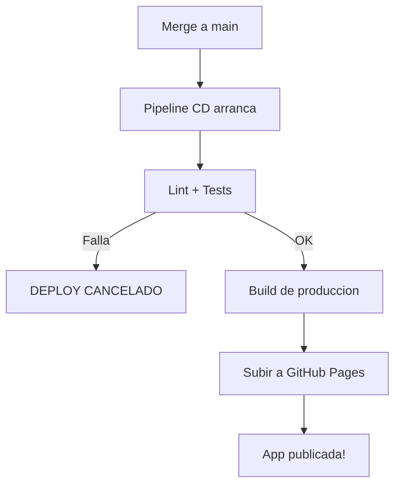

# Guia de CI/CD - Como trabajamos en este proyecto

## Resumen rapido

En este proyecto usamos **dos ramas principales** y **dos pipelines automaticos** que se encargan de verificar y publicar nuestro codigo.

- Trabajamos en la rama `dev`
- Cuando el codigo esta listo, lo pasamos a `main` mediante un Pull Request
- Al llegar a `main`, se publica automaticamente en GitHub Pages

## Como es el flujo de trabajo



## Paso a paso

### 1. Trabajar en la rama `dev`

Todo el desarrollo se hace en la rama `dev`. Nunca hacemos commits directamente en `main`.

```bash
# Asegurarte de estar en dev
git checkout dev

# Hacer tus cambios en el codigo...

# Agregar los archivos modificados
git add archivo1.jsx archivo2.css

# Crear un commit con un mensaje descriptivo
git commit -m "TICK-XX: Descripcion de lo que hiciste"

# Subir los cambios a GitHub
git push origin dev
```

### 2. Que pasa cuando haces push (Pipeline CI)

Cada vez que haces `git push` a la rama `dev` (o cualquier rama que no sea `main`), GitHub ejecuta automaticamente el **Pipeline CI**. Este pipeline:

1. Descarga el codigo
2. Instala las dependencias (`npm ci`)
3. Ejecuta el linter para verificar que el codigo sigue las reglas de estilo
4. Ejecuta los tests para verificar que nada esta roto



Si algo falla, lo puedes ver en la pestana **Actions** del repositorio en GitHub.

### 3. Crear un Pull Request

Cuando el pipeline CI pasa en verde, es momento de crear un **Pull Request** (PR) para llevar los cambios a `main`:

1. Ve al repositorio en GitHub
2. Haz clic en **Pull Requests** > **New Pull Request**
3. Selecciona `main` como base y `dev` como compare
4. Escribe un titulo y descripcion de los cambios
5. Haz clic en **Create Pull Request**

### 4. Que pasa cuando se aprueba el PR (Pipeline CD)

Al hacer merge del Pull Request a `main`, se ejecuta automaticamente el **Pipeline CD**:

1. Primero ejecuta lint y tests (igual que el CI, por seguridad)
2. Si pasan, hace build de la aplicacion
3. Sube el build a GitHub Pages
4. La app se publica automaticamente



La app queda disponible en: https://mmarmol.github.io/VIU_20GIAR_ACTIVIDAD/

### 5. Sincronizar dev despues del merge

Despues de que el PR se mergea a `main`, hay que actualizar `dev`:

```bash
git checkout main
git pull origin main
git checkout dev
git merge main
```

## Donde estan los pipelines

Los pipelines son archivos YAML que viven dentro del repositorio:

```
.github/
  workflows/
    ci.yml      <-- Pipeline CI (lint + tests)
    deploy.yml  <-- Pipeline CD (lint + tests + build + deploy)
```

## Pipeline CI explicado linea por linea

Archivo: `.github/workflows/ci.yml`

```yaml
name: CI                          # Nombre del pipeline

on:
  push:
    branches-ignore:
      - main                      # Se ejecuta en TODAS las ramas EXCEPTO main

jobs:
  lint-and-test:                  # Nombre del trabajo
    runs-on: ubuntu-latest        # Usa una maquina Linux en la nube

    steps:
      - uses: actions/checkout@v5          # Descarga el codigo del repo

      - uses: actions/setup-node@v5        # Instala Node.js
        with:
          node-version: 22                 # Version de Node.js
          cache: npm                       # Cachea dependencias para ir mas rapido

      - run: npm ci                        # Instala las dependencias del proyecto

      - name: Lint                         # Paso: verificar estilo del codigo
        run: npm run lint

      - name: Test                         # Paso: ejecutar tests
        run: npm run test
```

## Pipeline CD explicado linea por linea

Archivo: `.github/workflows/deploy.yml`

```yaml
name: Deploy                      # Nombre del pipeline

on:
  push:
    branches:
      - main                      # SOLO se ejecuta cuando hay cambios en main

permissions:                      # Permisos que necesita el pipeline
  contents: read                  # Leer el codigo
  pages: write                    # Escribir en GitHub Pages
  id-token: write                 # Token para autenticarse

concurrency:                      # Evita que dos deploys corran al mismo tiempo
  group: pages
  cancel-in-progress: false

jobs:
  lint-and-test:                  # PRIMER TRABAJO: verificar el codigo
    runs-on: ubuntu-latest
    steps:
      - uses: actions/checkout@v5
      - uses: actions/setup-node@v5
        with:
          node-version: 22
          cache: npm
      - run: npm ci
      - name: Lint
        run: npm run lint
      - name: Test
        run: npm run test

  build:                          # SEGUNDO TRABAJO: construir la app
    needs: lint-and-test          # Solo corre si lint-and-test paso OK
    runs-on: ubuntu-latest
    steps:
      - uses: actions/checkout@v5
      - uses: actions/setup-node@v5
        with:
          node-version: 22
          cache: npm
      - run: npm ci
      - name: Build
        run: npm run build                          # Genera la app en carpeta dist/
      - uses: actions/upload-pages-artifact@v3      # Sube dist/ como artefacto
        with:
          path: dist

  deploy:                         # TERCER TRABAJO: publicar la app
    needs: build                  # Solo corre si build paso OK
    runs-on: ubuntu-latest
    environment:
      name: github-pages                                 # Entorno de GitHub Pages
      url: ${{ steps.deployment.outputs.page_url }}       # URL de la app
    steps:
      - id: deployment
        uses: actions/deploy-pages@v4    # Publica el artefacto en GitHub Pages
```

## Si algo falla

1. Ve a la pestana **Actions** en GitHub
2. Busca el pipeline que fallo (tendra una X roja)
3. Haz clic para ver los logs
4. Busca el paso que fallo y lee el mensaje de error
5. Corrige el codigo, haz commit y push de nuevo
