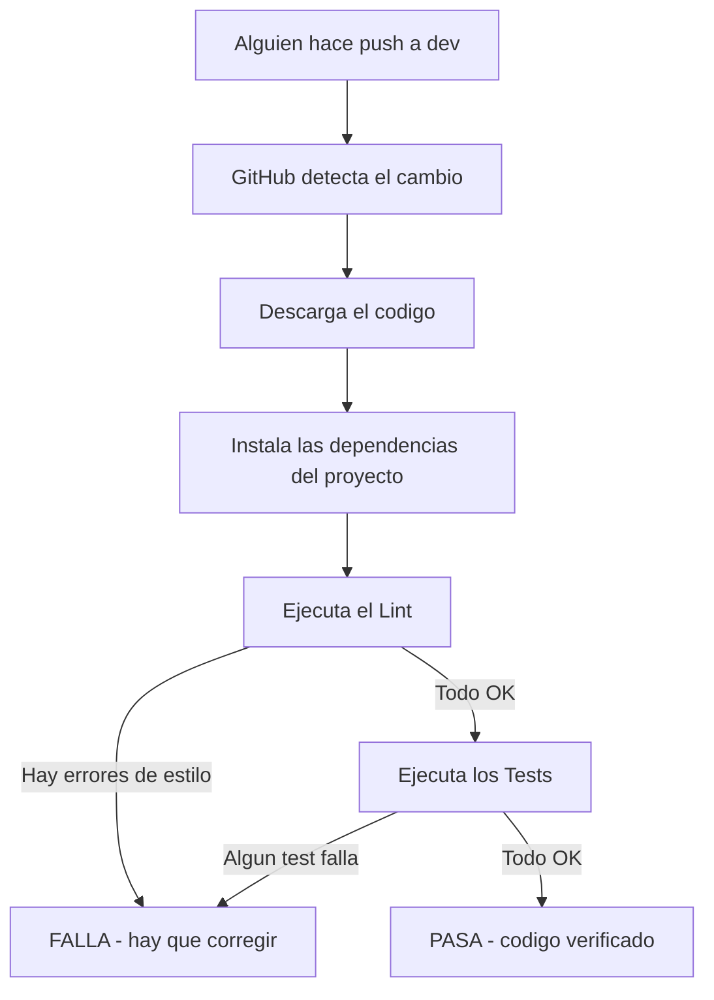
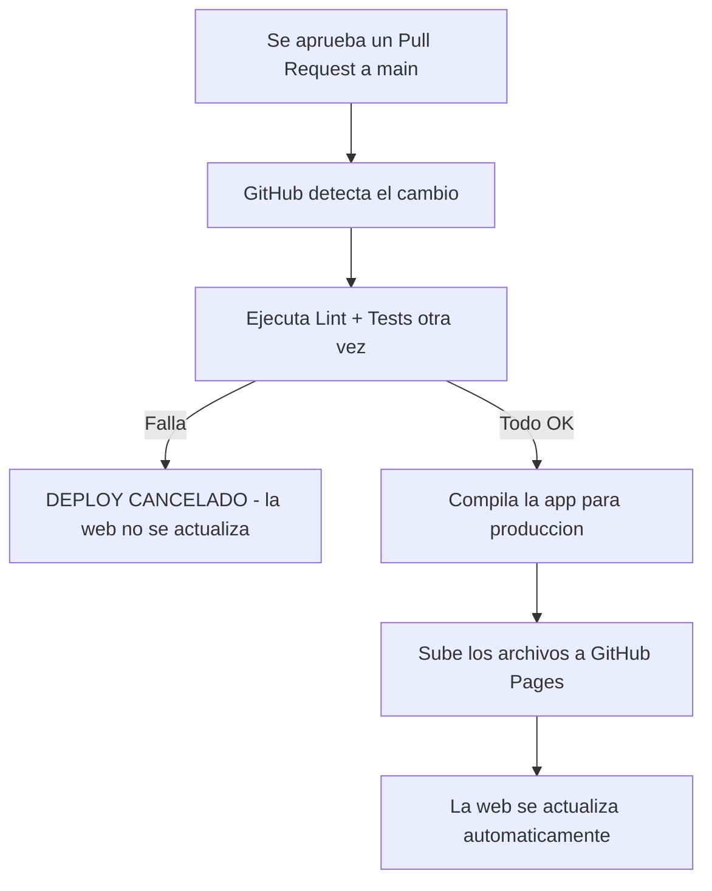
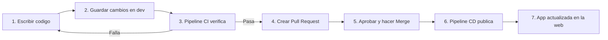

# Guia para el equipo - Financial Dashboard

Este documento explica de forma simple que hicimos en este proyecto, que tecnologias usamos y como funciona todo el proceso de desarrollo y publicacion. Si lees esto completo, vas a poder explicar la actividad en clase sin problemas.

## Que hicimos

Creamos una aplicacion web llamada **Financial Dashboard**. Es una pagina que muestra graficos de acciones de bolsa (como Apple, Google, Tesla, etc).

La aplicacion hace lo siguiente:

1. **Login**: el usuario entra con usuario y contraseña (administrador / viu2026)
2. **Dashboard**: despues de entrar ve dos graficos: uno de precio y uno de volumen
3. **Filtros**: puede elegir que accion ver (AAPL, GOOGL, MSFT, AMZN, TSLA) y en que periodo de tiempo (1 semana, 1 mes, 3 meses, etc)
4. **Logout**: puede cerrar sesion y vuelve al login

La app esta publicada en: https://mmarmol.github.io/VIU_20GIAR_ACTIVIDAD/

## Tecnologias que usamos

| Tecnologia | Para que sirve |
|------------|----------------|
| **React** | Es la libreria para construir la interfaz (lo que ve el usuario) |
| **Vite** | Es la herramienta que arranca el proyecto y lo compila para produccion |
| **Recharts** | Es la libreria que dibuja los graficos de linea y de barras |
| **Alpha Vantage** | Es una API gratuita de donde sacamos los datos de acciones. Si no funciona, usamos datos de ejemplo |
| **GitHub Pages** | Es donde esta publicada la app. Es un hosting gratuito de GitHub |
| **GitHub Actions** | Es lo que ejecuta los pipelines de CI/CD automaticamente |
| **ESLint** | Verifica que el codigo siga las reglas de estilo (como un corrector ortografico pero de codigo) |
| **Vitest** | Ejecuta los tests automaticos para verificar que nada esta roto |

## Metodologia de trabajo

Usamos **Kanban** para organizar las tareas. Cada tarea (ticket) se fue moviendo de "Por hacer" a "En progreso" a "Hecho" en un tablero de Trello.

Las tareas las gestionamos en: https://trello.com/b/tBDHhGKS/dashboard-financiero-kanban

---

## CI/CD - La parte mas importante de la actividad

CI/CD significa **Integracion Continua** y **Despliegue Continuo**. Son procesos automaticos que verifican y publican el codigo sin que tengamos que hacerlo manualmente.

### El concepto basico

Imagina que tienes un documento de Word compartido con tu equipo:

- **Sin CI/CD**: cada persona edita el documento, lo guarda y reza para que no haya conflictos. Luego alguien tiene que subir manualmente la version final a la web.
- **Con CI/CD**: cada vez que alguien guarda cambios, automaticamente se revisa que no haya errores de ortografia (lint), que todo tenga sentido (tests), y si todo esta bien, se publica automaticamente.

### Que son las ramas (branches)

En Git, una **rama** es como una copia del proyecto donde puedes trabajar sin afectar al resto. Nosotros usamos dos:

- **`dev`**: es donde hacemos el desarrollo. Aqui escribimos codigo y probamos cosas.
- **`main`**: es la version "oficial". Lo que esta en main es lo que esta publicado en la web.

La regla principal es: **nunca se escribe directamente en main**. Todo pasa por `dev` primero.

### Que es un Pull Request (PR)

Un Pull Request es una solicitud para pasar los cambios de una rama a otra. Es como decir: "termine mi trabajo en `dev`, revisa y pasalo a `main`".

En GitHub se crea desde la web: se selecciona la rama origen (`dev`) y la rama destino (`main`), se describe lo que se hizo, y se envia.

### Los dos pipelines

Un **pipeline** es una secuencia de pasos automaticos que se ejecutan cuando pasan ciertas cosas en el repositorio. Tenemos dos:

#### Pipeline CI (Integracion Continua)

**Cuando se ejecuta:** cada vez que hacemos push a `dev` (o cualquier rama que no sea `main`)

**Que hace:**



**En palabras simples:** cada vez que subimos codigo, GitHub automaticamente verifica que el codigo esta bien escrito (lint) y que todo funciona (tests). Si algo falla, nos avisa.

#### Pipeline CD (Despliegue Continuo)

**Cuando se ejecuta:** cada vez que se hace merge de un Pull Request a `main`

**Que hace:**



**En palabras simples:** cuando pasamos codigo a `main`, GitHub primero verifica que todo esta OK (por seguridad), luego compila la aplicacion y la publica automaticamente en la web. No tenemos que hacer nada manual.

### El flujo completo

Asi es como trabajamos de principio a fin:



### Donde vive todo esto

Los pipelines son archivos de texto (YAML) que estan dentro del proyecto:

```
.github/
  workflows/
    ci.yml       --> Pipeline CI (verifica el codigo)
    deploy.yml   --> Pipeline CD (publica la app)
```

GitHub lee estos archivos y sabe que hacer cuando detecta cambios en el repositorio. No hay que configurar nada externo, todo vive dentro del proyecto.

### Como ver si un pipeline paso o fallo

1. Entra al repositorio en GitHub
2. Haz clic en la pestana **Actions** (arriba)
3. Veras una lista de ejecuciones con un icono verde (paso) o rojo (fallo)
4. Haz clic en cualquiera para ver los detalles paso a paso

### Por que esto es importante

En un proyecto real, el CI/CD nos da estas ventajas:

- **No se sube codigo roto**: si los tests fallan, no se puede publicar
- **No hay pasos manuales**: todo es automatico, nadie se olvida de nada
- **Todos ven el estado**: cualquiera puede ver si el ultimo cambio paso o fallo
- **La web siempre esta actualizada**: cada merge a main actualiza la app publicada

---

## Resumen para la presentacion

Si tenes que explicar esto en clase, los puntos clave son:

1. **Hicimos una app web** que muestra graficos financieros con React
2. **Usamos Kanban** para organizar las tareas del proyecto
3. **Trabajamos con dos ramas**: `dev` para desarrollar y `main` para produccion
4. **Tenemos dos pipelines automaticos**:
   - **CI**: verifica el codigo cada vez que lo subimos (lint + tests)
   - **CD**: publica la app automaticamente cuando pasamos codigo a main
5. **La app esta publicada** en GitHub Pages sin necesidad de un servidor propio
6. **Todo es automatico**: escribimos codigo, lo subimos, y si esta bien, se publica solo
