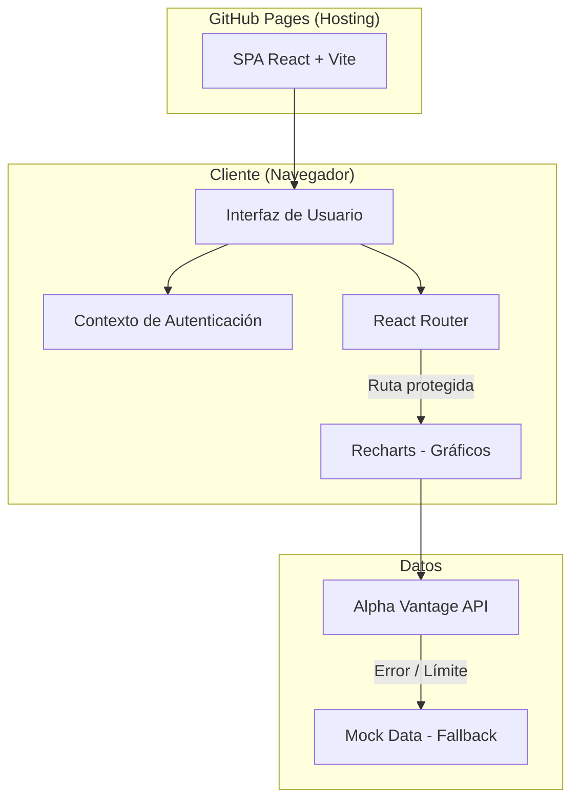
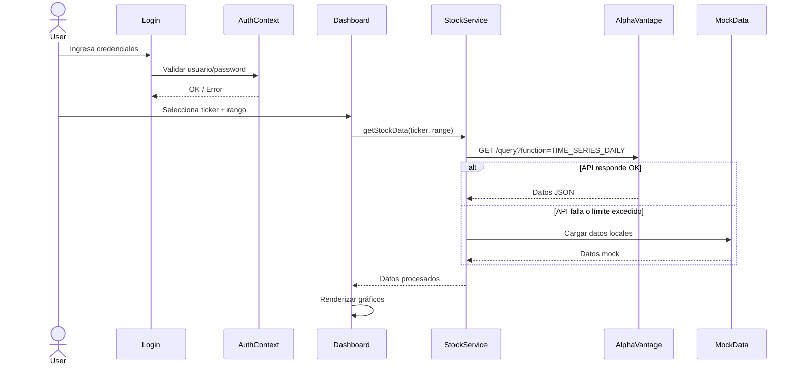
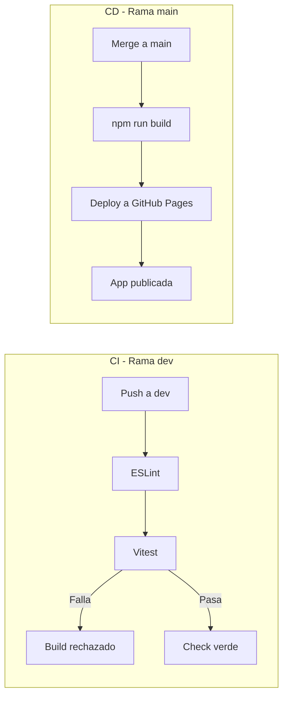

# Kanban - Dashboard Financiero

## Tickets

---

### TICK-01: Inicializar proyecto

**Estado:** Backlog
**Prioridad:** Alta

Crear el proyecto base con Vite + React. Definir la estructura de carpetas del proyecto.

**Estructura esperada:**

```
src/
  components/
  pages/
  services/
  context/
  assets/
  App.jsx
  main.jsx
```

**Criterios de aceptación:**
- El proyecto arranca con `npm run dev`
- Estructura de carpetas creada
- Dependencias base instaladas (react, react-router-dom, recharts)

---

### TICK-02: Configurar ESLint

**Estado:** Backlog
**Prioridad:** Alta

Configurar ESLint con reglas para React y buenas prácticas de código.

**Criterios de aceptación:**
- ESLint configurado y funcionando con `npm run lint`
- Reglas aplicadas para React (react/recommended, react-hooks)
- Sin errores de lint en el código base inicial

---

### TICK-03: Configurar Vitest

**Estado:** Backlog
**Prioridad:** Alta

Configurar el framework de testing con Vitest y React Testing Library.

**Criterios de aceptación:**
- Vitest configurado y funcionando con `npm run test`
- React Testing Library instalada
- Un test de ejemplo ejecutándose correctamente

---

### TICK-04: Implementar login

**Estado:** Backlog
**Prioridad:** Alta

Crear pantalla de login con formulario de usuario y contraseña. Las credenciales son hardcodeadas (ej: `admin` / `admin123`). Gestionar el estado de autenticación con React Context.

**Criterios de aceptación:**
- Formulario con campos usuario y contraseña
- Validación contra credenciales hardcodeadas
- Mensaje de error si las credenciales son incorrectas
- Al autenticarse, se redirige al dashboard
- Estado de auth gestionado con Context API

---

### TICK-05: Implementar logout

**Estado:** Backlog
**Prioridad:** Alta

Agregar botón de logout visible en la navbar del dashboard. Al hacer logout se limpia la sesión y se redirige al login.

**Criterios de aceptación:**
- Botón de logout en la navbar
- Al hacer click se limpia el estado de autenticación
- Redirección automática a la pantalla de login

---

### TICK-06: Proteger rutas

**Estado:** Backlog
**Prioridad:** Alta

Implementar un componente `ProtectedRoute` que redirija a login si el usuario no está autenticado.

**Criterios de aceptación:**
- Acceder al dashboard sin login redirige a `/login`
- Acceder a `/login` estando autenticado redirige al dashboard
- La navegación directa por URL también está protegida

---

### TICK-07: Crear layout principal

**Estado:** Backlog
**Prioridad:** Media

Diseñar el layout del dashboard: navbar superior con nombre de la app y botón de logout, y el area de contenido principal donde se muestran los gráficos y filtros.

**Criterios de aceptación:**
- Navbar con título de la app y botón de logout
- Area de contenido principal responsive
- Estilo limpio y funcional

---

### TICK-08: Integrar API financiera

**Estado:** Backlog
**Prioridad:** Alta

Crear un servicio que consuma la API de Alpha Vantage para obtener datos de stocks. Incluir datos mock como fallback cuando se agote el límite de la API (25 requests/día en el tier gratuito).

**Criterios de aceptación:**
- Servicio con función para obtener datos de un ticker
- Integración con Alpha Vantage (TIME_SERIES_DAILY o similar)
- Datos mock que se activan automáticamente si la API falla o no responde
- Manejo de estados de carga y error

---

### TICK-09: Gráfico de precio

**Estado:** Backlog
**Prioridad:** Media

Implementar un gráfico de línea temporal que muestre el precio de cierre de un stock a lo largo del tiempo usando Recharts.

**Criterios de aceptación:**
- Gráfico de línea con eje X (fecha) e Y (precio)
- Tooltip al pasar el cursor mostrando fecha y precio
- Se actualiza al cambiar de ticker o rango temporal
- Estado de carga mientras obtiene datos

---

### TICK-10: Gráfico de volumen

**Estado:** Backlog
**Prioridad:** Media

Implementar un gráfico de barras que muestre el volumen de operaciones diarias del stock seleccionado.

**Criterios de aceptación:**
- Gráfico de barras con eje X (fecha) e Y (volumen)
- Sincronizado con el gráfico de precio (mismo ticker y rango)
- Tooltip con datos de volumen

---

### TICK-11: Filtro por ticker

**Estado:** Backlog
**Prioridad:** Media

Implementar un selector que permita elegir entre varios tickers predefinidos (ej: AAPL, GOOGL, MSFT, AMZN, TSLA).

**Criterios de aceptación:**
- Dropdown o lista de tickers disponibles
- Al seleccionar un ticker se actualizan los gráficos
- Indicador visual del ticker activo

---

### TICK-12: Filtro por rango temporal

**Estado:** Backlog
**Prioridad:** Media

Implementar un selector de periodo que filtre los datos mostrados en los gráficos.

**Opciones:** 1 semana, 1 mes, 3 meses, 6 meses, 1 año

**Criterios de aceptación:**
- Botones o selector con las opciones de rango
- Al cambiar el rango se filtran los datos en los gráficos
- Indicador visual del rango activo

---

### TICK-13: Tests de autenticación

**Estado:** Backlog
**Prioridad:** Media

Escribir tests unitarios para el flujo de autenticación.

**Tests a cubrir:**
- Login con credenciales correctas redirige al dashboard
- Login con credenciales incorrectas muestra error
- Logout limpia la sesión
- Ruta protegida redirige a login sin autenticación

**Criterios de aceptación:**
- Todos los tests pasan
- Cobertura del flujo completo de auth

---

### TICK-14: Tests de dashboard

**Estado:** Backlog
**Prioridad:** Media

Escribir tests unitarios para los componentes del dashboard.

**Tests a cubrir:**
- Los gráficos se renderizan con datos mock
- Los filtros cambian el estado correctamente
- Manejo de estado de carga y error

**Criterios de aceptación:**
- Todos los tests pasan
- Componentes del dashboard testeados con datos mock

---

### TICK-15: Pipeline CI (dev)

**Estado:** Backlog
**Prioridad:** Alta

Crear un workflow de GitHub Actions que se ejecute en cada push a la rama `dev`. Debe ejecutar lint y tests automáticamente.

**Criterios de aceptación:**
- Workflow en `.github/workflows/ci.yml`
- Se dispara en push a `dev`
- Ejecuta `npm run lint`
- Ejecuta `npm run test`
- El pipeline falla si lint o tests fallan

---

### TICK-16: Pipeline CD (main)

**Estado:** Backlog
**Prioridad:** Alta

Crear un workflow de GitHub Actions que se ejecute en cada merge a `main`. Debe hacer build del proyecto y desplegarlo a GitHub Pages.

**Criterios de aceptación:**
- Workflow en `.github/workflows/deploy.yml`
- Se dispara en push a `main`
- Ejecuta build de producción
- Despliega a GitHub Pages automáticamente
- La app es accesible en `https://<usuario>.github.io/<repo>/`

---

### TICK-17: Documentar arquitectura

**Estado:** Backlog
**Prioridad:** Media

Crear documentación de la arquitectura del proyecto con diagramas que expliquen la estructura, el flujo de datos y los pipelines de CI/CD.

**Diagrama de arquitectura general:**



**Diagrama de flujo de datos:**



**Diagrama de pipelines CI/CD:**



**Criterios de aceptación:**
- Documento con descripción de la arquitectura
- Diagramas de mermaid renderizables en GitHub
- Explicación de decisiones de diseño
- Descripción del flujo de datos completo

---

### TICK-18: Documentar README

**Estado:** Backlog
**Prioridad:** Baja

Actualizar el README del repositorio con información de setup, uso y tecnologías.

**Contenido esperado:**
- Descripción del proyecto
- Tecnologías usadas
- Instrucciones de instalación y ejecución local
- Credenciales de acceso para la demo
- Link a la app desplegada en GitHub Pages

**Criterios de aceptación:**
- README actualizado con toda la información
- Instrucciones claras para ejecutar el proyecto localmente
